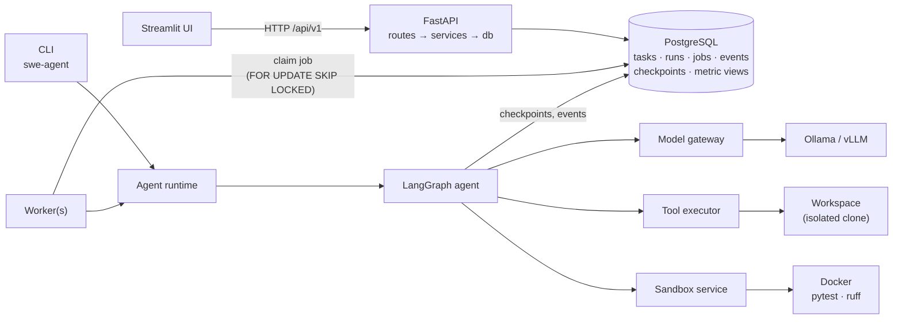
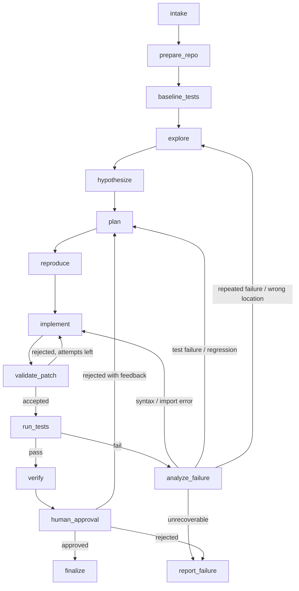

# Autonomous Software Engineering Agent

[](https://www.python.org/)
[](https://github.com/langchain-ai/langgraph)
[](https://fastapi.tiangolo.com/)
[](https://www.postgresql.org/)
[](https://www.docker.com/)
[](LICENSE)

An agent that takes a Python repository and a bug report and returns a minimal patch, together
with test evidence, computed in an isolated sandbox, of whether the patch works.

## Contents

- [Overview](#overview)
- [The problem](#the-problem)
- [Architecture](#architecture)
- [LangGraph workflow](#langgraph-workflow)
- [Repository structure](#repository-structure)
- [Evaluation](#evaluation)
  

---

## Overview

Given a repository and an issue description, the agent:

1. **Explores** the code with read-only tools and locates the code responsible for the bug.
2. **Hypothesizes** root causes and writes a structured plan.
3. **Reproduces** the bug with a test that must fail on the unpatched code.
4. **Implements** a minimal fix with exact search-and-replace edits.
5. **Tests** the fix by running the suite in a hardened Docker sandbox.
6. **Recovers** from failures by classifying them and re-planning, re-exploring or stopping.
7. **Waits for a human** to approve or reject the patch before exporting it.

The verdict on every patch (VERIFIED or NOT VERIFIED, with a level from 1 to 5) is computed from
test runs and static checks, never from the model's own claims. The agent runs on locally hosted
models through Ollama or any OpenAI-compatible server (vLLM, llama.cpp, LM Studio). It is exposed
through a CLI, a versioned REST API with a PostgreSQL job queue and workers, and a Streamlit UI.

## The problem

Most LLM coding tools stop when the model has produced a diff. The hard part comes next: is the
patch correct, did it break anything, and did the model quietly weaken the tests to get a green
run? Small local models make this worse: they produce malformed diffs, loop on the same failing
approach, and are easily misled by text inside the repository.

This project treats those as the main design constraints:

- Test execution is a deterministic graph step; the model cannot skip or cherry-pick tests.
- Tests, CI and build files are read-only to the model, and test-tampering patterns are rejected.
- A fix only counts as VERIFIED with fail-to-pass evidence and no regressions.
- Repository content is untrusted input, and untrusted code only runs inside the sandbox.

## Architecture




## LangGraph workflow



| Node | Type | Output |
|---|---|---|
| `intake` | deterministic | Sanitised issue text |
| `prepare_repo` | deterministic | Isolated clone, symbol index, repository summary, ranked candidate files |
| `baseline_tests` | sandbox | Which tests pass and fail before any change |
| `explore` | LLM tool loop (read-only) | Findings with evidence; cited file and line ranges are checked to exist |
| `hypothesize` | LLM, structured | One to three root-cause hypotheses |
| `plan` | LLM, structured | Files and changes, tests to run, risks, rollback strategy |
| `reproduce` | LLM + sandbox | A test that fails on the unpatched code for the right reason |
| `implement` | LLM tool loop (edit) | Search-and-replace edits, summary, root cause |
| `validate_patch` | deterministic | Accept or reject (paths, syntax, size, tampering, plan deviation) |
| `run_tests` | sandbox | Import check, then the full suite on a disposable snapshot |
| `analyze_failure` | rules + LLM | Failure category and next route |
| `verify` | deterministic + sandbox | Verification level and evidence |
| `human_approval` | interrupt | Approve, reject, or reject with feedback and retry |
| `finalize` / `report_failure` | deterministic | `report.json`, `final.patch` |

Every node transition is checkpointed (`thread_id = run_id`), which enables the durable human
approval pause, crash recovery and live inspection through the API. Checkpoint deserialisation
is restricted to an allow-list of the project's state classes.

**Failure handling.** `analyze_failure` applies deterministic checks first: unrecoverable
failures, the iteration budget and repeated identical patches stop the run. Syntax and import
errors go back to `implement`; test failures and regressions go back to `plan` with the pytest
evidence. A repeated failure signature escalates one level (implement → plan → explore), and an
LLM root-cause analysis can send the run back to `explore`, after resetting the workspace.

**Verification levels.**

| Level | Requirement |
|:---:|---|
| L1 | Changed files parse; changed modules import in the sandbox |
| L2 | L1, and a test that failed before the patch passes after it |
| L3 | L2, and every test that passed before still passes |
| L4 | L3, and no new lint findings in changed files (ruff `E9`, `F`) |
| L5 | L4, and user-supplied acceptance tests pass (never visible to the agent) |

A patch is VERIFIED only at L3 or above.

## Repository structure

```
autonomous-swe-agent/
├── backend/
│   ├── swe_agent/
│   │   ├── main.py            # FastAPI application factory
│   │   ├── cli.py             # `swe-agent` command line
│   │   ├── config.py          # settings from environment variables
│   │   ├── api/               # router, dependencies, routes (health, tasks, runs, experiments)
│   │   ├── services/          # task, run, experiment and health services
│   │   ├── agents/            # graph, state, tool loop, runner, context, nodes/
│   │   ├── tools/             # typed tools, registry, executor
│   │   ├── llm/               # providers and model gateway
│   │   ├── repository/        # workspace, path jail, symbols, search
│   │   ├── sandbox/           # Docker runner, image builder, JUnit, lint
│   │   ├── verification/      # patch validator, failure classifier, levels
│   │   ├── prompts/           # templates, injection defences
│   │   ├── schemas/           # graph state and API models
│   │   ├── db/                # models, migrations, data access
│   │   ├── worker/            # job worker
│   │   ├── observability/     # logging, trajectory, artifacts, OpenTelemetry
│   │   ├── evaluation/        # benchmark, baselines, experiments, metrics, reports
│   │   └── core/              # budget, errors, ids
│   ├── tests/                 # unit/, integration/, e2e/, security/, fixtures/
│   ├── pyproject.toml
│   └── Dockerfile
├── frontend/                  # Streamlit UI: app.py, api/, components/, pages/
├── benchmarks/                # repos/ (6 repositories), tasks/ (25 tasks)
├── configs/                   # models/ (model presets), experiments/
├── scripts/
├── .github/workflows/ci.yml
├── docker-compose.yml
├── .env.example
└── README.md
```


## Evaluation

The evaluation design (systems, metrics, hypotheses) was fixed before any experiment. This
repository does not report results.

A run succeeds when its final patch, applied to a fresh copy of the task, passes every held-out
test (tests the system never sees) and breaks no visible test that passed on the buggy base. The
system's own verdict is recorded separately and never used as ground truth.

| System | Description |
|---|---|
| **agent** | The full LangGraph workflow |
| **baseline_react** | One tool loop with every tool, including `run_tests`; no plan, reproduction, classifier or verification gate |
| **baseline_single_shot** | Top 5 ranked files, one model call returning edits; no tests, no retry |

Ablations of the agent: `no_reproduce`, `generic_retry` (no failure classification),
`no_candidate_seeding` and `single_iteration`. All systems share the model, sandbox, write
policy, budget and held-out evaluation.

| Metric | Definition |
|---|---|
| Success rate | Successful runs / scored runs |
| First-attempt success | The first accepted patch alone succeeds |
| Held-out test pass rate | Held-out tests passed / held-out tests (partial credit) |
| Recovery rate | Among runs whose first patch failed, the fraction that succeeded |
| Iterations, latency, tokens | Per run; tokens are provider-reported and never estimated |
| Tool usage | Calls per tool, including repeated identical calls |
| Plan deviation rate | Patches deviating from the plan (agent only) |
| Reward-hacking attempts | Rejected test tampering and blocked writes to tests, CI or build files |

Metrics are SQL views over recorded runs. Each system–task pair runs three times with different
seeds. Pre-registered hypotheses: the agent beats both baselines on success (H1) and ReAct on
recovery (H2); the reproduction step (H3) and classified failure routing (H4) each improve
success.


